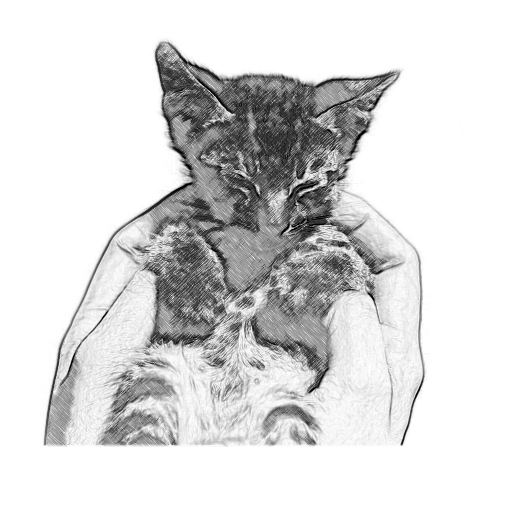

# Foster meow!

An app where people can foster animals

## Stack
- Rails
- React.js
- PostgresQL

## ERD

## Backend
rails g controller Authentication

rails g scaffold User username:string email:string password_digest:string 
rails g scaffold Animal title description age:integer sex:string default_image user:references
rails g scaffold AnimalImage image_url:text animal:references
rails g model SavedAnimal user:references animal:references

rails db:migrate
rails db:seed 
bundle 

